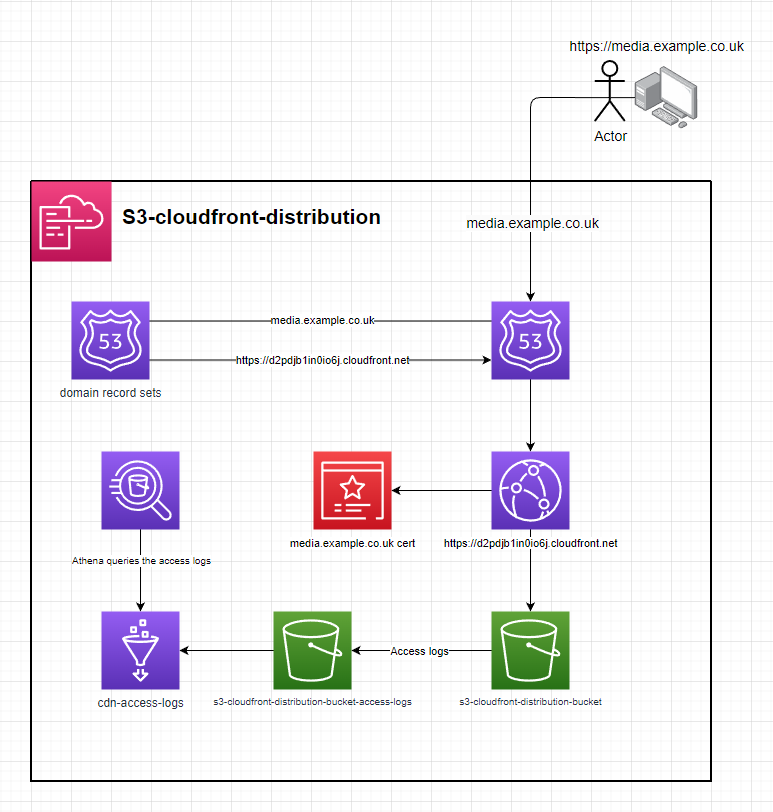
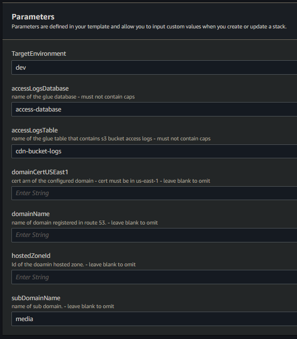

# s3-cloudfront-distribution

cloudfront distribution with an s3 origin behind a domain

## setup

1. deploy the template to cloudformation
2. enter the parameters

3. optionally fill out `domainCertUSEast1`, `domainName`, `hostedZoneId` & `subDomainName` for cloudformation to configure a CNAME & for route53 to create a recordSet.
4. upload the contents of /s3 to the origin & it will be accessiable from CloudFront
